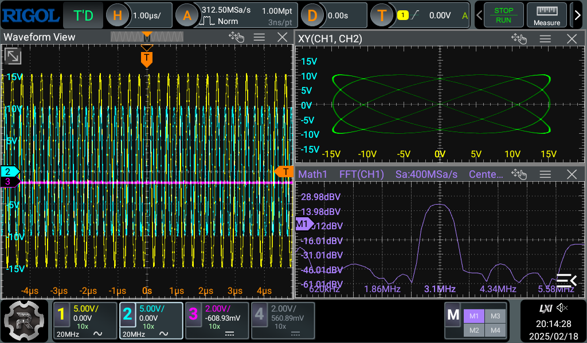
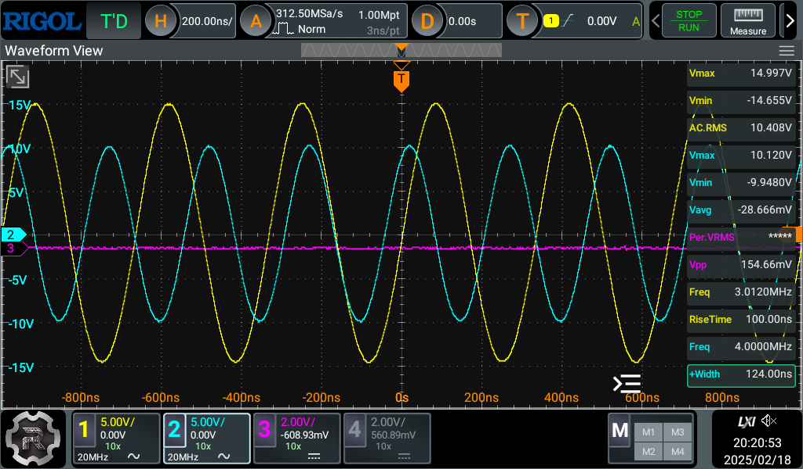

For the English version, please use the browser's built-in translator.

# Модифицированное приложение Sparrow для осциллографа Rigol DHO800/DHO900

#### *Выражаю благодарность всем участникам темы на форуме EEvblog за помощь, подсказки и советы - [https://www.eevblog.com/forum/testgear/hacking-the-rigol-dho800900-scope](https://www.eevblog.com/forum/testgear/hacking-the-rigol-dho800900-scope)*

Если вам понравился этот проект, то вы можете поддержать его 300 рублями через ЮМани по [вот этой ссылке](https://yoomoney.ru/quickpay/fundraise/button?billNumber=17P19CIPI3F.250114&)

## Содержание
* [Главное](#главное)
* [История изменений](#история-изменений)
* [Скриншоты](#скриншоты)

# Главное
Модификация приложения Rigol DHO800/DHO900 повышает удобство использования осциллографа, улучшая интерфейс и добавляя в него новые возможности.

## Текущие изменения по сравнению с оригинальной версией
- Изменена заставка при запуске приложения (сплэшскрин). Это сделано для того чтобы было видно когда заканчивается загрузки системы и запускается само приложение.
- Двойным тапом на иконку канала внизу экрана у этого канала изменяется режим блокировки между AC и DC.
- В иконки каналов внизу экрана добавлено отображение текущего делителя щупа. [Смотреть скриншоты](#скриншоты).
- Пункты результатов измерений на панели слева уменьшены по высоте для того чтобы можно было видеть большее количество измерений одновременно. Кроме того, немного увеличен шрифт значений измерений для более легкой читаемости. [Смотреть скриншоты](#скриншоты)
- Раскрытые пункты результатов измерений изменены на табличный вид: имя параметра и слева от него значение этого параметра. Это уменьшило высоту раскрытого пункта, позволив видеть одновременно до трех раскрытых пунктов. У значений так же немного увеличен шрифт для более легкой читаемости. [Смотреть скриншоты](#скриншоты).
- У стрелок раскрытия и закрытия пунктов результатов измерений увеличена область чувствительности к нажатию. Теперь раскрыть и закрыть пункт гораздо проще.
- В левый верхний угол окна осциллограммы добавлена иконка раскрытия этого окна на весь экран. Этой же иконкой окно сворачивается обратно в оригинальный размер. [Смотреть скриншоты](#скриншоты).
- В правом нижнем углу включено отображение текущего времени и даты.

# История изменений
#### **a003** 19.01.2025
- Изменена заставка при запуске приложения (сплэшскрин). Это сделано для того чтобы было видно когда заканчивается загрузка системы и запускается само приложение.
- Двойным тапом на иконку канала внизу экрана у этого канала изменяется режим блокировки между AC и DC.

#### **a002** 13.01.2025
- В иконки каналов внизу экрана добавлено отображение текущего делителя щупа. [Смотреть скриншоты](#скриншоты).
- Пункты результатов измерений на панели слева уменьшены по высоте для того чтобы можно было видеть большее количество измерений одновременно. Кроме того, немного увеличен шрифт значений измерений для более легкой читаемости. [Смотреть скриншоты](#скриншоты)
- Раскрытые пункты результатов измерений изменены на табличный вид: имя параметра и слева от него значение этого параметра. Это уменьшило высоту раскрытого пункта, позволив видеть одновременно до трех раскрытых пунктов. У значений так же немного увеличен шрифт для более легкой читаемости. [Смотреть скриншоты](#скриншоты).
- У стрелок раскрытия и закрытия пунктов результатов измерений увеличена область чувствительности к нажатию. Теперь раскрыть и закрыть пункт гораздо проще.
- В левый верхний угол окна осциллограммы добавлена иконка раскрытия этого окна на весь экран. Этой же иконкой окно сворачивается обратно в оригинальный размер. [Смотреть скриншоты](#скриншоты).
- В правом нижнем углу включено отображение текущего времени и даты.

# Скриншоты
### Три окна в обычном режиме

### Три окна в режиме "на весь экран"

### Два окна горизонтально в обычном режиме

### Два окна горизонтально в режиме "на весь экран"

### Два окна вертикально в обычном режиме

### Два окна вертикально в режиме "на весь экран"

### Одно окно в режиме "на весь экран"

### Панель результатов измерений в обычном режиме

### Панель результатов измерений в режиме "на весь экран"

