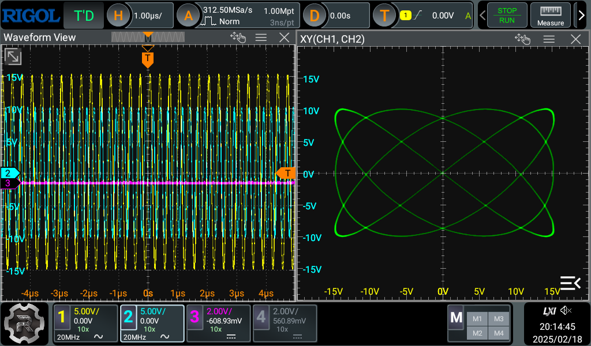
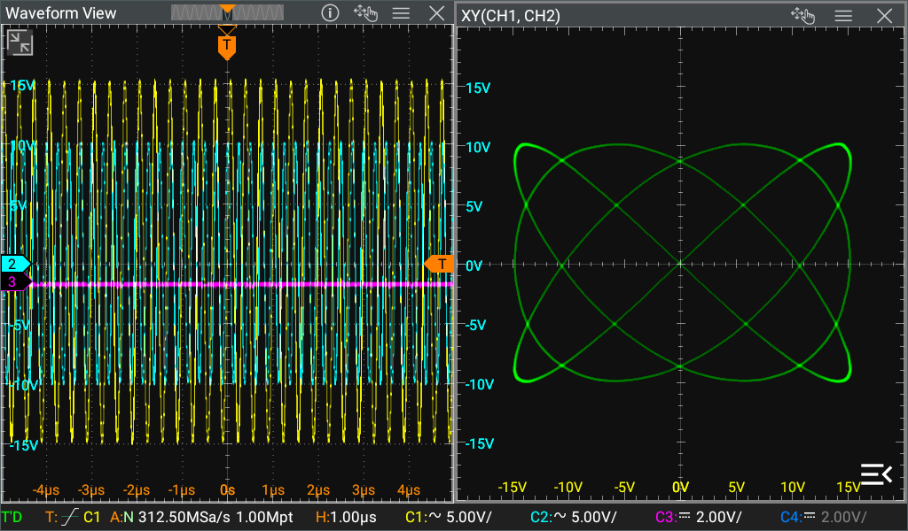
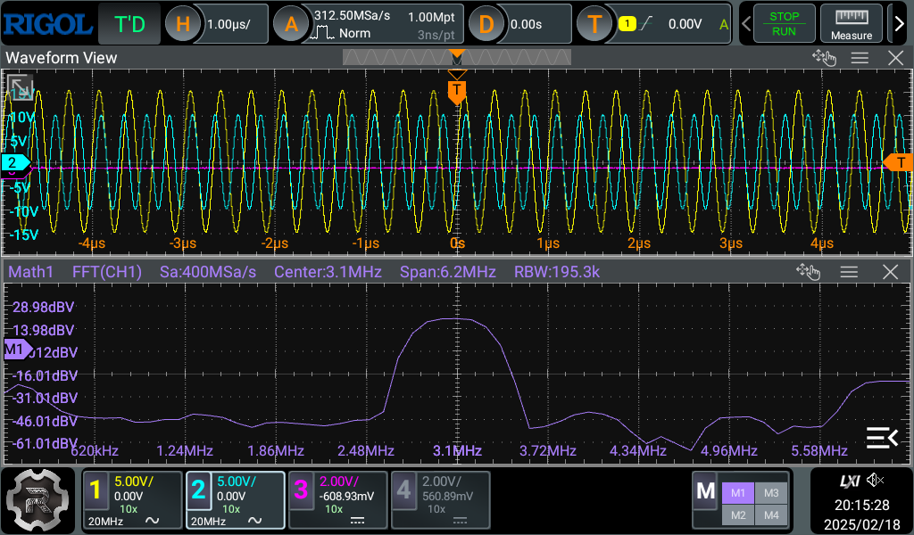
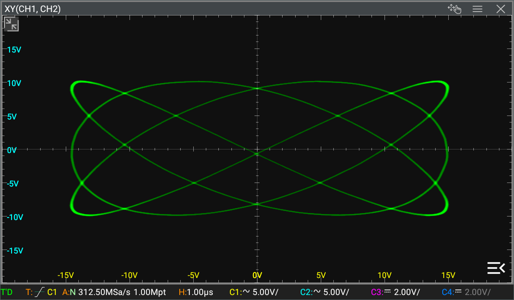
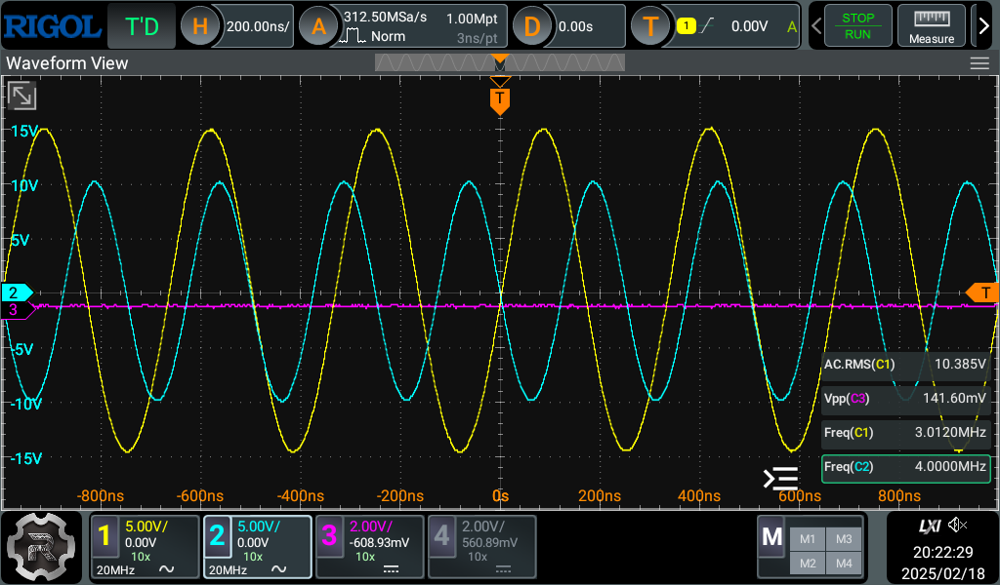
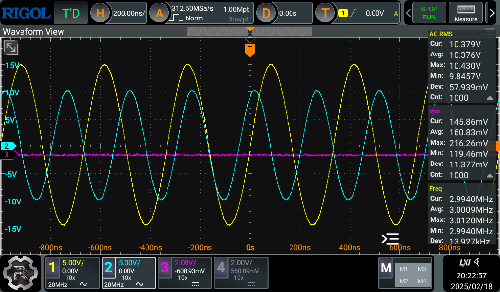
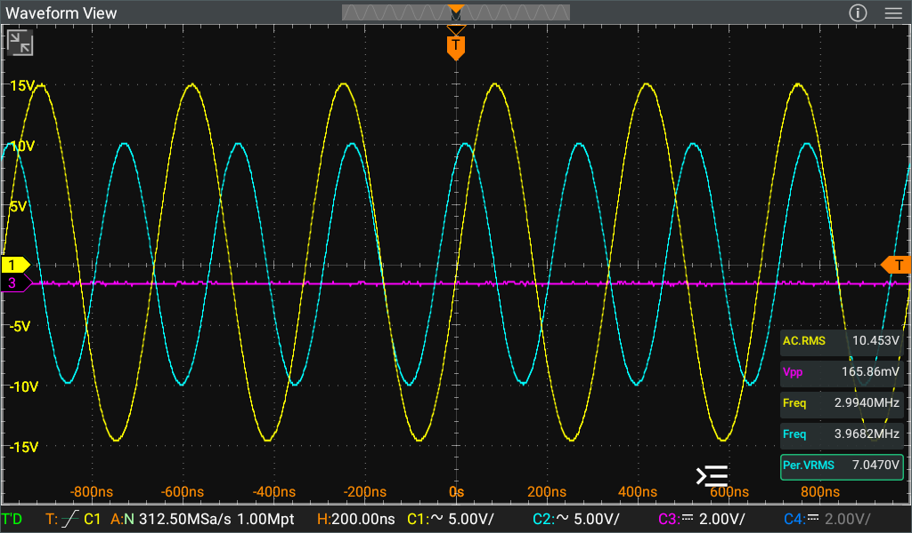

[//]: # (Downloads Badge Center)
[//]: # "Centered Image"

[English version](#english-version)

# Модифицированное приложение Sparrow (интерфейс) для осциллографа Rigol DHO800/DHO900

#### *Выражаю благодарность всем участникам темы на форумах EEvblog и 4PDA за помощь, подсказки и советы - [https://www.eevblog.com/forum/testgear/hacking-the-rigol-dho800900-scope](https://www.eevblog.com/forum/testgear/hacking-the-rigol-dho800900-scope) , [https://4pda.to/forum/index.php?showtopic=1080959](https://4pda.to/forum/index.php?showtopic=1080959)*

Если вам понравился этот проект, то вы можете поддержать его 300 рублями через ЮМани по [вот этой ссылке](https://yoomoney.ru/quickpay/fundraise/button?billNumber=17P19CIPI3F.250114&)

Telegram: [@Rigol DHO800/DHO900 mod](https://t.me/rigol_dho800_mod)

## Содержание

* [Главное](#главное)
* [Установка](#установка)
* [История изменений](#история-изменений)
* [Скриншоты](#скриншоты)

# Главное

Модификация приложения Rigol DHO800/DHO900 повышает удобство использования осциллографа, улучшая интерфейс и добавляя в него новые возможности.

## Текущие изменения по сравнению с оригинальной версией  ([Смотреть скриншоты](#скриншоты))

* В правом нижнем углу включено отображение текущего времени и даты.
* В левый верхний угол окна осциллограммы добавлена иконка раскрытия этого окна на весь экран. Этой же иконкой окно сворачивается обратно в оригинальный размер.
* В полноэкранном режиме доступна небольшая инфопанель снизу с информацией о режиме и частоте дискретизации, глубине памяти, режиме триггера, связи и масштабе каналов, горизонтальном масштабе. Эта инфопанель может скрываться и показываться по нажатию на иконку (i) в правом верхнем углу в заголовке окна.
* Исправлены ошибки производителя:
  * после включения осциллографа яркость курсоров устанавливается на 100%, независимо от настроенного ранее значения, яркость приводится к настройкам только при открытии окна настроек дисплея
  * иконка режимов триггера в верхней панели не соответствовала выбранному режиму в некоторых случаях
* У стрелок раскрытия и закрытия пунктов результатов измерений увеличена область чувствительности к нажатию. Теперь раскрыть и закрыть пункт гораздо проще.
* Раскрытые пункты результатов измерений изменены на табличный вид: имя параметра и слева от него значение этого параметра. Это уменьшило высоту раскрытого пункта, позволив видеть одновременно до трех раскрытых пунктов. У значений так же немного увеличен шрифт для более легкой читаемости.
* Пункты результатов измерений на панели слева уменьшены по высоте для того чтобы можно было видеть большее количество измерений одновременно. Кроме того, немного увеличен шрифт значений измерений для более легкой читаемости.
* В иконки каналов внизу экрана добавлено отображение текущего делителя щупа.
* Двойным тапом на иконку канала внизу экрана у этого канала изменяется режим блокировки между AC и DC.
* Изменена заставка при запуске приложения (сплэшскрин). Это сделано для того чтобы было видно когда заканчивается загрузки системы и запускается само приложение.
* Панель измерений полностью прозрачная, список измерений в ней прижат вниз, так что при 3-4 измерениях они практически не мешают просмотру сигнала.
* Значения вертикальной шкалы теперь не перепрыгивают на левую или правую сторону главного окна осциллограммы при раскрытии и сворачивании панели измерений, а всегда остаются слева.
* Панель измерений немного приподнята чтобы не загораживать горизонтальную шкалу
* Фон пунктов измерений сделан чуть более темным.
* Значок-стрелка разворачивания пунктов измерений убрана, так что пункты измерений стали слегка ниже. Разворачивание производится нажатием в правой части пункта измерений.
* Пункты результатов измерений теперь можно переключать между стандартным, с названием канала, и цветным, без названия. Без названий каналов пункты измерений становятся более компактными и занимают меньше места. Переключение производится пунктом "*Names/Colors*" меню, вызываемого нажатием на пункт результата измерения.
* Текст подписей для сигналов в окне осциллограмм теперь обрамлен черной обводкой, так что они стали более заметными на форе сигналов.

# Установка

Модифицированное приложение существует в двух версиях:

* **Sparrow_aXXX.apk** - версия для установки на пропатченную систему - это рекомендованный вариант.
* **Sparrow_aXXX_u.apk** - версия для установки на оригинальную систему.

## Что такое патч системы Android и зачем он нужен?

Система Android обладает системой разграничения прав пользователей и системой проверки подписи приложений. Самыми широкими правами обладает пользователь **system** и если приложение хочет установиться как системное и получать доступ к некоторым ограниченным системным функциям, то оно должно заявить себя как приложение с правами пользователя **system**. Но проблема в том, что для того, чтобы приложение могло заявить себя как системное, оно должно быть подписано тем же ключом, которым подписана сама сборка Android. Такой ключ имеется только у производителя устройства, а значит никто больше не может подписать приложение с правами пользователя **system**.  

Патч системы Android заключается в том чтобы отключить проверку подписи приложений. Это делается путем замены одного из системных файлов, который отвечает за проверку подписи приложений. После этого любое приложение может заявиться как системное приложение с правами пользователя **system** и получить доступ к ограниченным функциям Андроида, будучи подписанным любым ключом.  

Патч системы устанавливается только один раз, в дальнейшем при переустановке или обновлении модифицированного приложения его повторная установка уже не требуется. Этот патч так же не мешает работе оригинального приложения, так что если вы решите откатиться к оригинальной версии, то вам не придется откатывать патч. Хотя если по каким-то причинам захочется откатить патч, то это легко сделать.

### Какая разница между версиями?

* Версия **Sparrow_aXXX.apk** - это версия для установки на пропатченную систему. Она заявляет себя как системное приложение с правами пользователя **system** и может получать доступ к любым системным функциям.
* Версия **Sparrow_aXXX_u.apk** - это версия для установки на оригинальную систему. Она не заявляется как системное приложение и работает с ограниченными правами обычного пользователя. В результате эта версия не сможет, например, сохранять скриншоты, т.к. Андроид не даст ей доступ к содержимому экрана.

## Подготовка к установке

Для установки как патча, так и любой из версий модифицированного приложения, вам потребуется ADB. Загрузить его можно с [официального сайта](https://developer.android.com/studio/releases/platform-tools).  

Осциллограф должен быть подключен к одной сети с компьютером - кабелем или через Wi-Fi.  

Необходимо скачать архив нужной версии из [раздела релизов](/releases). Распакуйте эти файлы в каталог с ADB (или в любой другой если вы добавили ADB в системные переменные среды). Запустите в этой папке командную строку (открыть эту папку в проводнике и в его адресной строке ввести команду cmd) и дальше вводите в командной строке показанные ниже команды. Вводить нужно только то, что выделено ***жирным курсивом***, можно прямо копировать указанные команды и вставлять их в командную строку.

## Установка патча системы

Первой идет команда подключения ADB к устройству по его IP-адресу. IP-адрес осциллографа можно увидеть в самом осциллографе в меню **Utility->IO**. Подставьте адрес своего осциллографа вместо 192.168.1.41:  
***adb connect 192.168.1.41:55555***  
В ответ ADB должен сообщить об успешном подключении:  
*connected to 192.168.1.41:55555*

Теперь нужно загрузить в осциллограф пропатченный системный файл:  
***adb push services.jar /rigol/data/***  
И получить ответ об успешности:  
*services.jar: 1 file pushed, 0 skipped. 59.7 MB/s (3179392 bytes in 0.051s)*  

Теперь запустите шелл ADB.  
***adb shell***  
При этом вместо подсказки командной строки системы (например D:\\Rigol>) появится подсказка командной строки осциллографа, и далее команды вводятся в этой командной строке:  
*rk3399_rigol:/ \$*  

Получите права администратора:  
***su***  
Символ $ в подсказке сменится на символ #:  
*rk3399_rigol:/ #*

Сделайте системный раздел доступным для записи:  
***mount -o rw,remount  /system***  

Удалите оригинальный системный файл:  
***rm  /system/framework/services.jar -f***  

Удалите также его остаток в другом каталоге:  
***rm  /system/framework/oat/arm64/services.odex -f***  

И его кэш в другом каталоге тоже удалите:  
***rm  /data/dalvik-cache/arm64/system@framework@services.jar@classes.dex***  

Перенесите загруженный ранее в осциллограф пропатченный системный файл в системный раздел:  
***mv  /rigol/data/services.jar  /system/framework***  

Верните обратно системному разделу режим только для чтения:  
***mount -o ro,remount  /system***  

Команда синхронизации чтобы все изменения файловой системы точно сохранились:  
***sync***  

Перезагрузите осциллограф:
***reboot***  

В процессе перезагрузки шелл ADB отвалится и вернется подсказка командной строки вашей системы. Все, теперь ваш осциллограф верит всем приложениям на слово, что они являются системными, не проверяя верность ключа, которым они подписаны :)  
Если после перезагрузки осциллограф зависнет на экране загрузки - ничего страшного, просто выключите осциллограф длительным нажатием кнопки питания (или выдернув коннектор питания) и включите снова.

## Установка модифицированного приложения

Внимание! Установка версии **Sparrow_aXXX.apk** возможна только на пропатченной ранее системе. На оригинальной системе устанавливается версия **Sparrow_aXXX_u.apk**.

Первой идет команда подключения ADB к устройству по его IP-адресу. IP-адрес осциллографа можно увидеть в самом осциллографе в меню **Utility->IO**. Подставьте адрес своего осциллографа вместо 192.168.1.41:  
***adb connect 192.168.1.41:55555***  
В ответ ADB должен сообщить об успешном подключении:  
*connected to 192.168.1.41:55555*
Или о том, что он уже подключен:  
*already connected to 192.168.1.41:55555*  

Удалите установленное приложение осциллографа:  
***adb uninstall com.rigol.scope***  
Приложение на осциллографе должно закрыться и должен быть выдан ответ об успешности:  
*Success*  

Установите модифицированное приложение:  
***adb install -g -r Sparrow_aXXX.apk***  
(или ***adb install -g -r Sparrow_aXXX_u.apk*** если вы устанавливаете на непропатченную систему)  
Это может занять довольно много времени, но в итоге должен быть выдан ответ об успешности:  
*Performing Streamed Install*  
*Success*  

Приложение осциллографа должно само запуститься в течении 5-20 сек, но если не запускается - просто выключите осциллограф длительным нажатием кнопки питания (или выдернув коннектор питания) и включите снова.

# История изменений

#### **a007** 18.02.2025

* добавлена кнопка в заголовке окна для открытия/закрытия информационной панели в полноэкранном режиме
* добавлена в полноэкранную инфопанель информация о типе (иконкой) и канале триггера
* добавлена в полноэкранную инфопанель информация о горизонтальном масштабе
* добавлена в полноэкранную инфопанель информация о связи каналов (AC/DC/GND)
* добавлена в полноэкранную инфопанель информация о режиме захвата и глубине памяти
* фон полноэкранной инфопанели изменен на более темный
* исправлен баг Rigol: иконока режимов триггера в верхней панели не соответствовала выбранному режиму в некоторых случаях
* исправлен баг Rigol: после включения осциллографа яркость курсоров устанавливается на 100%, какой бы ни была ее настройка, яркость приводится к настройкам только при открытии окна настроек дисплея

#### **a006** 11.02.2025

* уменьшено пространство между пунктами измерений
* сделано сохранение и восстановление вида пунктов измерений - указание каналов именами или цветами
* исправлена ошибка: не работал пункт "Change item" в меню пунктов измерений
* исправлена ошибка: окно сигналов не раскрывалось на весь экран с первого клика по иконке раскрытия
* в полноэкранном режиме добавлена небольшая панель снизу с информацией о режиме/частоте дискретизации и масштабе каналов
* при нажатии на значение масштаба в информационной панели в полноэкранном режиме открывается окно настроек канала

#### **a005** 30.01.2025

* Текст подписей для сигналов в окне осциллограмм теперь обрамлен черной обводкой, так что они стали более заметными на форе сигналов.
* Пункты результатов измерений теперь можно переключать между стандартным, с названием канала, и цветным, без названия. Без названий каналов пункты измерений становятся более компактными и занимают меньше места. Переключение производится пунктом "*Names/Colors*" меню, вызываемого нажатием на пункт результата измерения.
* Значок-стрелка разворачивания пунктов измерений убрана, так что пункты измерений стали слегка ниже. Разворачивание производится нажатием в правой части пункта измерений.
* Фон пунктов измерений сделан чуть более темным.
* Панель измерений немного приподнята чтобы не загораживать горизонтальную шкалу

#### **a004** 24.01.2025

* Значения вертикальной шкалы теперь не перепрыгивают на левую или правую сторону главного окна осциллограммы при раскрытии и сворачивании панели измерений, а всегда остаются слева.
* Панель измерений полностью прозрачная, список измерений в ней прижат вниз, так что при 3-4 измерениях они практически не мешают просмотру сигнала.

#### **a003** 19.01.2025

* Изменена заставка при запуске приложения (сплэшскрин). Это сделано для того чтобы было видно когда заканчивается загрузки системы и запускается само приложение.
* Двойным тапом на иконку канала внизу экрана у этого канала изменяется режим блокировки между AC и DC.

#### **a002** 13.01.2025

* В иконки каналов внизу экрана добавлено отображение текущего делителя щупа. [Смотреть скриншоты](#скриншоты).
* Пункты результатов измерений на панели слева уменьшены по высоте для того чтобы можно было видеть большее количество измерений одновременно. Кроме того, немного увеличен шрифт значений измерений для более легкой читаемости. [Смотреть скриншоты](#скриншоты)
* Раскрытые пункты результатов измерений изменены на табличный вид: имя параметра и слева от него значение этого параметра. Это уменьшило высоту раскрытого пункта, позволив видеть одновременно до трех раскрытых пунктов. У значений так же немного увеличен шрифт для более легкой читаемости. [Смотреть скриншоты](#скриншоты).
* У стрелок раскрытия и закрытия пунктов результатов измерений увеличена область чувствительности к нажатию. Теперь раскрыть и закрыть пункт гораздо проще.
* В левый верхний угол окна осциллограммы добавлена иконка раскрытия этого окна на весь экран. Этой же иконкой окно сворачивается обратно в оригинальный размер. [Смотреть скриншоты](#скриншоты).
* В правом нижнем углу включено отображение текущего времени и даты.

# Скриншоты

### Три окна в обычном режиме

### Три окна в режиме "на весь экран"

### Два окна горизонтально в обычном режиме

### Два окна горизонтально в режиме "на весь экран"

### Два окна вертикально в обычном режиме

### Два окна вертикально в режиме "на весь экран"

### Одно окно в режиме "на весь экран"

### Панель результатов измерений в обычном режиме

### Панель результатов измерений в режиме "на весь экран"

### Панель результатов измерений в стандартном и цветовом режиме отображения каналов

### Полноэкранная инфопанель открыта/закрыта

---
 
 
 

### English version

# Modified Sparrow Application (interface) for Rigol DHO800/DHO900 Oscilloscope

#### *I would like to thank all participants of the EEvblog and 4PDA forum threads for their help, hints and advice - [https://www.eevblog.com/forum/testgear/hacking-the-rigol-dho800900-scope](https://www.eevblog.com/forum/testgear/hacking-the-rigol-dho800900-scope), [https://4pda.to/forum/index.php?showtopic=1080959](https://4pda.to/forum/index.php?showtopic=1080959)*

## Contents

* [Main](#main)
* [Installation](#installation)
* [Change History](#change-history)
* [Screenshots](#screenshots)

# Main

The modification of the Rigol DHO800/DHO900 application improves the usability of the oscilloscope by enhancing the interface and adding new features.

## Current Changes Compared to Original Version  [see screenshots](#screenshots)

* Enabled current time and date display in the bottom right corner.
* Added a full-screen icon to the top left corner of the waveform window. The same icon collapses the window back to original size.
* In full-screen mode, a small info panel is available at the bottom with information about the sampling mode and frequency, memory depth, trigger mode, channel connection and scale, horizontal scale. This info panel can be hidden and shown by clicking on the icon (i) in the upper right corner of the window header.
* Fixed manufacturer errors:
    * after turning on the oscilloscope, the cursor brightness is set to 100%, regardless of the previously configured value, the brightness is adjusted to the settings only when opening the display settings window
    * the trigger mode icon in the top panel did not correspond to the selected mode in some cases
* Increased touch sensitivity area for measurement result item expand/collapse arrows. Now it's much easier to expand and collapse items.
* Expanded measurement result items changed to tabular view: parameter name with its value to the left. This reduced the expanded item height, allowing up to three expanded items to be visible simultaneously. Values also have slightly increased font size for better readability.
* Measurement result items on the left panel have been reduced in height to show more measurements simultaneously. Additionally, the measurement value font size has been slightly increased for better readability.
* Added probe attenuation factor display to channel icons at the bottom of the screen.
* Double-tapping the channel icon at the bottom of the screen toggles that channel's coupling mode between AC and DC.
* Changed the application splash screen at startup. This is done to show when the system finishes loading and the application itself starts.
* The measurement panel is completely transparent, the list of measurements in it is pressed down, so that with 3-4 measurements they practically do not interfere with viewing the signal.
* The vertical scale values ​​no longer jump to the left or right side of the main oscillogram window when expanding and collapsing the measurement panel, but always remain on the left.
* The measurement panel has been slightly raised so as not to block the horizontal scale
* The background of the measurement items has been made slightly darker.
* The arrow icon for expanding the measurement items has been removed, so that the measurement items have become slightly lower. Expanding is done by clicking on the right side of the measurement item.
* The measurement result items can now be switched between the standard one, with the channel name, and the colored one, without a name. Without channel names, the measurement items become more compact and take up less space. Switching is done using the "*Names/Colors*" menu item, which is called by clicking on the measurement result item.
* The text of the waveform labels in the oscillogram window is now framed with a black outline, so that they are more visible on the signal form.

# Installation

The modified application exists in two versions:

* **Sparrow_axxx.apk** - version for installation on patched system - this is the recommended option.
* **Sparrow_axxx_u.apk** - version for installation on original system.

## What is Android System Patch and Why is it Needed?

Android system has user permission segregation and application signature verification systems. The **system** user has the broadest rights, and if an application wants to install as system and access certain restricted system functions, it must declare itself as an application with **system** user rights. However, the problem is that for an application to declare itself as system, it must be signed with the same key that signed the Android build itself. Only the device manufacturer has such a key, meaning no one else can sign an application with **system** user rights.

The Android system patch involves disabling application signature verification. This is done by replacing one of the system files responsible for verifying application signatures. After this, any application can declare itself as a system application with **system** user rights and access restricted Android functions while being signed with any key.

The system patch is installed only once; subsequent reinstallation or updates of the modified application do not require its reinstallation. This patch also doesn't interfere with the original application's operation, so if you decide to roll back to the original version, you won't need to roll back the patch. Although if for some reason you want to roll back the patch, it's easy to do.

### What's the Difference Between Versions?

* Version **Sparrow_axxx.apk** - this is the version for installation on patched system. It declares itself as a system application with **system** user rights and can access any system functions.
* Version **Sparrow_axxx_u.apk** - this is the version for installation on original system. It doesn't declare itself as a system application and works with limited regular user rights. As a result, this version won't be able to, for example, save screenshots, as Android won't give it access to screen content.

## Installation Preparation

For installing both the patch and any version of the modified application, you'll need ADB. You can download it from the [official website](https://developer.android.com/studio/releases/platform-tools).

The oscilloscope must be connected to the same network as the computer - via cable or Wi-Fi.

You need to download the archive of the needed version from the [releases section](/releases). Extract these files to the ADB directory (or any other if you've added ADB to system environment variables). Launch command prompt in this folder (open this folder in explorer and enter cmd in its address bar) and then enter the commands shown below in the command prompt. Enter only what's highlighted in ***bold italic***, you can directly copy the specified commands and paste them into the command prompt.

## System Patch Installation

First is the ADB connection command to the device by its IP address. The oscilloscope's IP address can be seen in the oscilloscope itself in the **Utility->IO** menu. Replace 192.168.1.41 with your oscilloscope's address:  
***adb connect 192.168.1.41:55555***  
ADB should respond with successful connection:  
*connected to 192.168.1.41:55555*  

Now you need to upload the patched system file to the oscilloscope:  
***adb push services.jar /rigol/data/***  
And get a success response:  
*services.jar: 1 file pushed, 0 skipped. 59.7 MB/s (3179392 bytes in 0.051s)*  

Now launch ADB shell.  
***adb shell***  
The system command prompt (e.g., D:\\Rigol>) will be replaced with the oscilloscope's command prompt, and further commands are entered in this command prompt:  
*rk3399_rigol:/ \$*  

Get administrator rights:  
***su***  
The $ symbol in the prompt will change to #:  
*rk3399_rigol:/ #*  

Make the system partition writable:  
***mount -o rw,remount /system***  

Delete the original system file:  
***rm /system/framework/services.jar -f***  

Also delete its remnant in another directory:  
***rm /system/framework/oat/arm64/services.odex -f***  

And delete its cache in another directory too:  
***rm /data/dalvik-cache/arm64/system@framework@services.jar@classes.dex***  

Move the previously uploaded patched system file to the system partition:  
***mv /rigol/data/services.jar /system/framework***  

Return the system partition back to read-only mode:  
***mount -o ro,remount /system***  

Sync command to ensure all filesystem changes are saved:  
***sync***  

Reboot the oscilloscope:  
***reboot***  

During reboot, the ADB shell will disconnect and return to your system's command prompt. Now your oscilloscope trusts all applications' claims about being system applications without verifying the key they're signed with :)
If after reboot the oscilloscope hangs on the loading screen - no worries, just turn off the oscilloscope by long-pressing the power button (or unplugging the power connector) and turn it on again.

## Modified Application Installation

Attention! Installation of **Sparrow_aXXX.apk** version is only possible on a previously patched system. On original system, install the **Sparrow_aXXX_u.apk** version.

First is the ADB connection command to the device by its IP address. The oscilloscope's IP address can be seen in the oscilloscope itself in the **Utility->IO** menu. Replace 192.168.1.41 with your oscilloscope's address:  
***adb connect 192.168.1.41:55555***  
ADB should respond with successful connection:  
*connected to 192.168.1.41:55555*  
Or that it's already connected:  
*already connected to 192.168.1.41:55555*  

Delete the installed oscilloscope application:  
***adb uninstall com.rigol.scope***
The application on the oscilloscope should close and a success response should be given:  
*Success*  

Install the modified application:  
***adb install -g -r Sparrow_aXXX.apk***  
(or ***adb install -g -r Sparrow_aXXX_u.apk*** if you're installing on unpatched system)  
This might take quite some time, but eventually should give a success response:  
*Performing Streamed Install*  
*Success*  

The oscilloscope application should start itself within 5-20 seconds, but if it doesn't start - just turn off the oscilloscope by long-pressing the power button (or unplugging the power connector) and turn it on again.

# Change History

#### **a007** 18.02.2025

* added a button in the window title to open/close the information panel in full-screen mode
* added information about the trigger type (icon) and channel to the full-screen information panel
* added information about the horizontal scale to the full-screen information panel
* added information about the channel connection (AC/DC/GND) to the full-screen information panel
* added information about the capture mode and memory depth to the full-screen information panel
* changed the background of the full-screen information panel to a darker color
* fixed a Rigol bug: the trigger mode icon in the top panel did not match the selected mode in some cases
* fixed a Rigol bug: after turning on the oscilloscope, the cursor brightness is set to 100%, no matter what its setting is, the brightness is adjusted to the settings only when the display settings window is opened

#### **a006** 11.02.2025

* reduced space between measurement points
* made saving and restoring the appearance of measurement points - specifying channels by names or colors
* fixed bug: the "Change item" item in the measurement points menu did not work
* fixed bug: the signal window did not expand to full screen with the first click on the expansion icon
* in full-screen mode, a small panel was added at the bottom with information about the sampling mode/frequency and channel scale
* when clicking on the scale value in the information panel in full-screen mode, the channel settings window opens

#### **a005** 30.01.2025

* The text of the waveform labels in the oscillogram window is now framed with a black outline, so that they are more visible on the signal form.
* The measurement result items can now be switched between the standard one, with the channel name, and the colored one, without a name. Without channel names, the measurement items become more compact and take up less space. Switching is done using the "*Names/Colors*" menu item, which is called by clicking on the measurement result item.
* The arrow icon for expanding the measurement items has been removed, so that the measurement items have become slightly lower. Expanding is done by clicking on the right side of the measurement item.
* The background of the measurement items has been made slightly darker.
* The measurement panel has been slightly raised so as not to block the horizontal scale

#### **a004** 24.01.2025

* The vertical scale values ​​no longer jump to the left or right side of the main oscillogram window when expanding and collapsing the measurement panel, but always remain on the left.
* The measurement panel is completely transparent, the list of measurements in it is pressed down, so that with 3-4 measurements they practically do not interfere with viewing the signal.

#### **a003** 19.01.2025

* Changed the application splash screen at startup. This is done to show when the system finishes loading and the application itself starts.
* Double-tapping the channel icon at the bottom of the screen toggles that channel's coupling mode between AC and DC.

#### **a002** 13.01.2025

* Added probe attenuation factor display to channel icons at the bottom of the screen. [See screenshots](#screenshots).
* Measurement result items on the left panel have been reduced in height to show more measurements simultaneously. Additionally, the measurement value font size has been slightly increased for better readability. [See screenshots](#screenshots)
* Expanded measurement result items changed to tabular view: parameter name with its value to the left. This reduced the expanded item height, allowing up to three expanded items to be visible simultaneously. Values also have slightly increased font size for better readability. [See screenshots](#screenshots).
* Increased touch sensitivity area for measurement result item expand/collapse arrows. Now it's much easier to expand and collapse items.
* Added a full-screen icon to the top left corner of the waveform window. The same icon collapses the window back to original size. [See screenshots](#screenshots).
* Enabled current time and date display in the bottom right corner.

# Screenshots

### Three windows in normal mode

### Three windows in full-screen mode

### Two windows horizontally in normal mode

### Two windows horizontally in full-screen mode

### Two windows vertically in normal mode

### Two windows vertically in full-screen mode

### One window in full-screen mode

### Measurement results panel in normal mode

### Measurement results panel in full-screen mode

### Measurement results panel in standard and color display mode

### Full-screen information panel opened/closed

