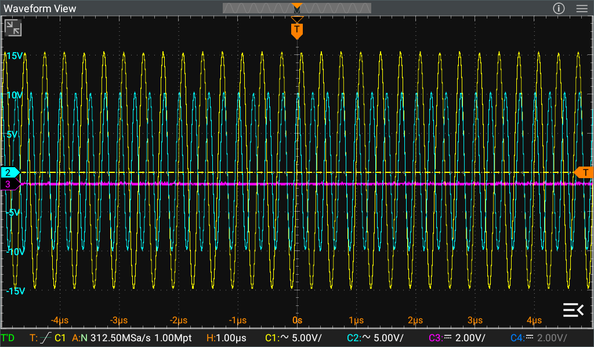
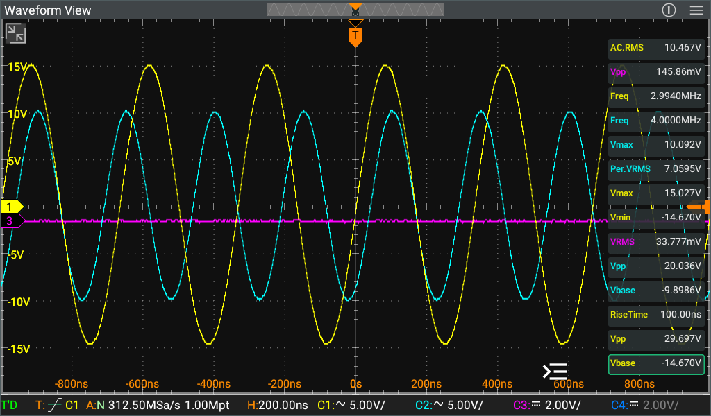

For the English version, please use the browser's built-in translator.

# Модифицированное приложение Sparrow для осциллографа Rigol DHO800/DHO900

#### *Выражаю благодарность всем участникам темы на форуме EEvblog за помощь, подсказки и советы - [https://www.eevblog.com/forum/testgear/hacking-the-rigol-dho800900-scope](https://www.eevblog.com/forum/testgear/hacking-the-rigol-dho800900-scope)*

Если вам понравился этот проект, то вы можете поддержать его 300 рублями через ЮМани по [вот этой ссылке](https://yoomoney.ru/quickpay/fundraise/button?billNumber=17P19CIPI3F.250114&)

## Содержание
* [Главное](#главное)
* [История изменений](#история-изменений)
* [Скриншоты](#скриншоты)

# Главное
Модификация приложения Rigol DHO800/DHO900 повышает удобство использования осциллографа, улучшая интерфейс и добавляя в него новые возможности.

## Текущие изменения по сравнению с оригинальной версией
- Изменена заставка при запуске приложения (сплэшскрин). Это сделано для того чтобы было видно когда заканчивается загрузки системы и запускается само приложение.
- Двойным тапом на иконку канала внизу экрана у этого канала изменяется режим блокировки между AC и DC.
- В иконки каналов внизу экрана добавлено отображение текущего делителя щупа. [Смотреть скриншоты](#скриншоты).
- Пункты результатов измерений на панели слева уменьшены по высоте для того чтобы можно было видеть большее количество измерений одновременно. Кроме того, немного увеличен шрифт значений измерений для более легкой читаемости. [Смотреть скриншоты](#скриншоты)
- Раскрытые пункты результатов измерений изменены на табличный вид: имя параметра и слева от него значение этого параметра. Это уменьшило высоту раскрытого пункта, позволив видеть одновременно до трех раскрытых пунктов. У значений так же немного увеличен шрифт для более легкой читаемости. [Смотреть скриншоты](#скриншоты).
- У стрелок раскрытия и закрытия пунктов результатов измерений увеличена область чувствительности к нажатию. Теперь раскрыть и закрыть пункт гораздо проще.
- В левый верхний угол окна осциллограммы добавлена иконка раскрытия этого окна на весь экран. Этой же иконкой окно сворачивается обратно в оригинальный размер. [Смотреть скриншоты](#скриншоты).
- В правом нижнем углу включено отображение текущего времени и даты.

# Установка
Модифицированное приложение существует в двух версиях:
- **Sparrow_axxx.apk** - версия для установки на пропатченную систему - это рекомендованный вариант.
- **Sparrow_axxx_u.apk** - версия для установки на оригинальную систему.
### Что такое патч системы Android и зачем он нужен?
Система Android обладает системой разграничения прав пользователей и системой проверки подписи приложений. Самыми широкими правами обладает пользователь **system** и если приложение хочет установиться как системное и получать доступ к некоторым ограниченным системным функциям, то оно должно заявить себя как приложение с правами пользователя **system**. Но проблема в том, что для того, чтобы приложение могло заявить себя как системное, оно должно быть подписано тем же ключом, которым подписана сама сборка Android. Такой ключ имеется только у производителя устройства, а значит никто больше не может подписать приложение с правами пользователя **system**.
Патч системы Android заключается в том чтобы отключить проверку подписи приложений. Это делается путем замены одного из системных файлов, который отвечает за проверку подписи приложений. После этого любое приложение может заявиться как системное приложение с правами пользователя **system** и получить доступ к ограниченным функциям Андроида, будучи подписанным любым ключом.
Патч системы устанавливается только один раз, в дальнейшем при переустановке или обновлении модифицированного приложения его повторная установка уже не требуется. Этот патч так же не мешает работе оригинального приложения, так что если вы решите откатиться к оригинальной версии, то вам не придется откатывать патч. Хотя если по каким-то причинам захочется откатить патч, то это легко сделать.
### Какая разница между версиями?
- Версия **Sparrow_axxx.apk** - это версия для установки на пропатченную систему. Она заявляет себя как системное приложение с правами пользователя **system** и может получать доступ к любым системным функциям.
- Версия **Sparrow_axxx_u.apk** - это версия для установки на оригинальную систему. Она не заявляется как системное и работает с ограниченными правами обычного пользователя. В результате эта версия не сможет, например, сохранять скриншоты, т.к. Андроид не даст ей доступ к содержимому экрана.

## Подготовка к установке
Для установки как патча, так и любой из версий модифицированного приложения, вам потребуется ADB. Загрузить его можно с [официального сайта](https://developer.android.com/studio/releases/platform-tools).
Осциллограф должен быть подключен к одной сети с компьютером - кабелем или через Wi-Fi.
Необходимо скачать архив нужной версии из [раздела релизов](/releases). Распакуйте эти файлы в каталог с ADB (или в любой другой если вы добавили ADB в системные переменные среды). Запустите в этой папке командную строку (открыть эту папку в проводнике и в его адресной строке ввести команду cmd) и дальше вводите в командной строке показанные ниже команды. Вводить нужно только то, что выделено жирным курсивом. Подсказки командной строки приведены только для наглядности и их вводить не нужно. Можно прямо копировать указанные команды и вставлять их в командную строку.

## Установка патча системы
Первой идет команда подключения ADB к устройству по его IP-адресу. IP-адрес осциллографа можно увидеть в самом осциллографе в меню **Utility->IO**. Подставьте адрес своего осциллографа вместо 192.168.1.41:
D:\rigol\***adb connect 192.168.1.41:55555***
В ответ ADB должен сообщить об успешном подключении:
*connected to 192.168.1.41:55555*

Теперь нужно загрузить в осциллограф пропатченный системный файл:
D:\rigol\***adb push services.jar /rigol/data/***
И получить ответ об успешности:
*services.jar: 1 file pushed, 0 skipped. 59.7 MB/s (3179392 bytes in 0.051s)*

Теперь запустите шелл ADB.
D:\rigol\***adb shell***
При этом вместо подсказки командной строки системы (например D:\Rigol>) появится подсказка командной строки осциллографа, и далее команды вводятся в этой командной строке:
*rk3399_rigol:/ $*

Получите права администратора:
rk3399_rigol:/ $ ***su***
Символ $ в подсказке сменится на символ #:
*rk3399_rigol:/ #*

Сделайте системный раздел доступным для записи:
rk3399_rigol:/ # ***mount -o rw,remount /system***

Удалите оригинальный системный файл:
rk3399_rigol:/ # ***rm /system/framework/services.jar -f***

Удалите также его остаток в другом каталоге:
rk3399_rigol:/ # ***rm /system/framework/oat/arm64/services.odex -f***

И его кэш в другом каталоге тоже удалите:
rk3399_rigol:/ # ***rm /data/dalvik-cache/arm64/system@framework@services.jar@classes.dex***

Перенесите загруженный ранее в осциллограф пропатченный системный файл в системный раздел:
rk3399_rigol:/ # ***mv /rigol/data/services.jar /system/framework***

Верните обратно системному разделу режим только для чтения:
rk3399_rigol:/ # ***mount -o ro,remount /system***

Команда синхронизации чтобы все изменения файловой системы точно сохранились:
rk3399_rigol:/ # ***sync***

Перезагрузите осциллограф:
rk3399_rigol:/ # ***reboot now***

В процессе перезагрузки шелл ADB отвалится и вернется подсказка командной строки вашей системы. Все, теперь ваш осциллограф верит всем приложения на слово, что они являются системными, не проверяя верность ключа, которым они подписаны :)
После того как осциллограф загрузится, можно устанавливать модифицированные приложения и они будут работать точно так же как и оригинальные, без каких-либо ограничений (конечно, если они собраны под системным аккаунтом).

# История изменений
#### **a003** 19.01.2025
- Изменена заставка при запуске приложения (сплэшскрин). Это сделано для того чтобы было видно когда заканчивается загрузка системы и запускается само приложение.
- Двойным тапом на иконку канала внизу экрана у этого канала изменяется режим блокировки между AC и DC.

#### **a002** 13.01.2025
- В иконки каналов внизу экрана добавлено отображение текущего делителя щупа. [Смотреть скриншоты](#скриншоты).
- Пункты результатов измерений на панели слева уменьшены по высоте для того чтобы можно было видеть большее количество измерений одновременно. Кроме того, немного увеличен шрифт значений измерений для более легкой читаемости. [Смотреть скриншоты](#скриншоты)
- Раскрытые пункты результатов измерений изменены на табличный вид: имя параметра и слева от него значение этого параметра. Это уменьшило высоту раскрытого пункта, позволив видеть одновременно до трех раскрытых пунктов. У значений так же немного увеличен шрифт для более легкой читаемости. [Смотреть скриншоты](#скриншоты).
- У стрелок раскрытия и закрытия пунктов результатов измерений увеличена область чувствительности к нажатию. Теперь раскрыть и закрыть пункт гораздо проще.
- В левый верхний угол окна осциллограммы добавлена иконка раскрытия этого окна на весь экран. Этой же иконкой окно сворачивается обратно в оригинальный размер. [Смотреть скриншоты](#скриншоты).
- В правом нижнем углу включено отображение текущего времени и даты.

# Скриншоты
### Три окна в обычном режиме

### Три окна в режиме "на весь экран"

### Два окна горизонтально в обычном режиме

### Два окна горизонтально в режиме "на весь экран"

### Два окна вертикально в обычном режиме

### Два окна вертикально в режиме "на весь экран"

### Одно окно в режиме "на весь экран"

### Панель результатов измерений в обычном режиме

### Панель результатов измерений в режиме "на весь экран"

